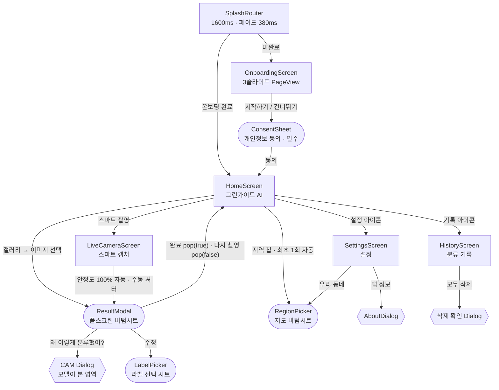

# 그린가이드 AI — UI/UX 구조 명세

> **분리수거 AI 가이드** — Flutter 앱 `waste_app`의 전체 UI/UX 구조 명세.
> 코드 실측 기준: `waste_app/lib/` (main.dart · screens 7종 · widgets 8종 · theme/app_theme.dart), 디자인 토큰: `waste-api/design/tokens.json` v1.1.0 (W3C Design Tokens draft).
> 스냅샷 기준일: 2026-07-28

- **Material 3** (`useMaterial3: true`, `Typography.material2021`, `ColorScheme.fromSeed`)
- **테마**: 시스템 / 라이트 / 다크 3종 (`ThemeMode`, SharedPreferences 저장, 실시간 전환)
- **시드 컬러**: brand `#2E7D32` (Green 800, 다크에서도 동일) · secondary `#C8EFC7` · tertiary `#EF6C00`
- **페이지 전환**: Android `PredictiveBackPageTransitionsBuilder` (M3 예측형 뒤로가기)
- **구성**: 화면 7 · 바텀시트/모달 6 · 재사용 위젯 8

---

## 1. 정보 구조 & 내비게이션 그래프

스플래시에서 온보딩 완료 여부로 분기한 뒤, **홈이 허브가 되는 허브-앤-스포크 구조**.
결과 표시는 별도 화면이 아니라 풀스크린 바텀시트(**ResultModal**)가 담당한다.

- 사각형 = 화면(push/pushReplacement) · 둥근 괄호 = 바텀시트(showModalBottomSheet) · 육각형 = 다이얼로그(showDialog)

### 전환 상세

| 구간 | 트리거 | 방식 / 모션 |
|---|---|---|
| Splash → Home/온보딩 | 1600ms 타이머 + 온보딩 완료 판정 | pushReplacement · FadeTransition 380ms easeOut |
| 온보딩 슬라이드 이동 | 「다음」 버튼 | PageController.nextPage 380ms easeOutCubic |
| 온보딩 → 동의 시트 | 「시작하기」·「건너뛰기」(미동의 시) | 바텀시트 · dismissible=false, drag=false |
| Home → 카메라/기록/설정 | 버튼 · AppBar 아이콘 | MaterialPageRoute (M3 예측형 뒤로가기) |
| Home/카메라 → ResultModal | 갤러리 선택 · 자동/수동 캡처 | 풀스크린 바텀시트 · enableDrag=false |
| ResultModal 닫힘 | 「완료」/「다시 촬영」 | pop(true) → 홈 복귀 · pop(false) → 카메라 유지 |
| 지역 선택 L1 → L2 | 지도 시도 탭 · GPS 버튼 | 시트 내부 상태 전환, 완료 시 pop((시도, 시군구)) |
| Home ↔ 결과 이미지 | 공유 요소 | Hero 태그 `preview-image` |

---

## 2. 화면별 구조

각 화면의 AppBar → 본문 섹션(순서대로) → CTA → 상태 변형. 따옴표 안은 실제 사용자 노출 UI 문자열.

### 2.1 SplashRouter — `screens/splash_screen.dart`
브랜드 인상 + 온보딩/홈 라우팅 분기.
- **본문**: primary 전체 배경 · 중앙 로고 160×160 · "그린가이드 AI"(22pt w700) · "분리수거 AI 가이드"(13pt)
- **모션**: 진입 fade+scale 0.55→1.0 (easeOutBack 900ms) → 펄스 1.0↔1.06 (1400ms 반복) · 타이틀 지연 페이드

### 2.2 OnboardingScreen — `screens/onboarding_screen.dart`
3슬라이드 가치 제안 + 개인정보 동의 게이트.
- **슬라이드**: ① "사진 한 장으로 분리수거 끝" ② "CNN 기반 정확한 분류" ③ "피드백으로 함께 만드는 AI" — 원형 아이콘 카드 + 제목 + 설명
- **CTA**: "다음" → 마지막 페이지 "시작하기" (FilledButton.icon) · 우상단 "건너뛰기"
- **디테일**: 도트 인디케이터 활성 24px / 비활성 8px (AnimatedContainer 250ms)

### 2.3 HomeScreen — `screens/home_screen.dart`
허브 화면 — 이미지 입력 진입점 + 사용법 안내.
- **AppBar**: "그린가이드 AI" · actions: 테스트 모드 토글(usb) / "분류 기록"(history) / "설정"(settings)
- **본문 순서**: 지역 ActionChip("지역 설정하기" 또는 "시도 시군구") → 정사각 Hero 프리뷰(빈 상태: "분류할 사진을 추가해주세요") → 액션 버튼 Row → 힌트 카드(API 주소/테스트 모드) → "사용 방법" 4스텝 카드(①사진 촬영 또는 선택 ②AI 가 자동 분류 ③분리수거 안내 확인 ④피드백 보내기)
- **CTA**: "스마트 촬영"(FilledButton, auto_awesome) · "갤러리"(OutlinedButton, photo_library)
- **상태**: loading → 프리뷰 오버레이 + "분류 중...", 버튼 비활성 · 스크롤 200px 초과 → 「맨 위로」 소형 FAB

### 2.4 LiveCameraScreen — `screens/live_camera_screen.dart`
풀스크린 스마트 캡처 — 안정도 기반 자동 촬영 + 수동 셔터.
- **구성**: 전체 카메라 프리뷰 + CameraOverlay(프레이밍 박스·안정도 바·힌트) · 상단 닫기 + "스마트 캡처" 배지 · 하단 76px 흰 링 셔터
- **상태**: 준비 중 "카메라 준비 중..." · 권한 거부 "카메라 권한이 필요합니다" + "돌아가기"/"다시 시도" · 캡처 시 heavyImpact 햅틱 + 화이트 플래시 300ms
- **생명주기**: inactive → dispose · resumed → 재초기화

### 2.5 ResultModal (결과 표시 핵심) — `widgets/result_modal.dart` (2,271줄)
분류 결과 풀스크린 바텀시트 — 이미지 오버레이·판정 카드·지역 안내·피드백까지 단일 시트에서 처리.
- **로딩**: 마일스톤 진행바 12% → 52% → 100% · "분류 중..." → "재질 분석 중..." → "완료"
- **이미지 뷰**: 재질 영역 빗금 오버레이 + 라벨 배지 · 객체 번호 마커 · 탭 마커 · "되돌리기" 칩(10단계 스택) · 힌트 "🎯 물건을 탭하면 그 물건만 분류해요"
- **결과 분기**:
  1. 다중 재질 → "여러 재질이 섞여 있어요" (RejectCard + MultiMaterialCard, 재질별 방법)
  2. 다중 물건 → "여러 물건이 보여요"
  3. 분류 불가 → "기타/분류 불가" ("모델 추측: …")
  4. 일반 → PredictionCard(라벨·신뢰도 점·cloud 검증 배지) + GuideCard(배출함·배출방법) · 불확실 시 "확실하지 않아요" 배너
- **부가 카드**: "사진 속 물건 N개"(ObjectsCard) · 판정 근거 EvidenceChips · "우리 동네 배출 안내 · {시군구}"(RegionCard, "출처: 공공데이터포털") · 품질 배너(어두움/흔들림) · FeedbackCard
- **CTA**: 하단 고정 ActionBar — "다시 촬영"(outlined) / "완료"(filled) · "왜 이렇게 분류했어?" → CAM 다이얼로그
- **에러**: errorContainer 카드 + "다시 시도" · 재질/객체/지역/CAM 실패 시 원본으로 진행(graceful degradation)

### 2.6 HistoryScreen — `screens/history_screen.dart`
로컬 분류 기록 목록.
- **AppBar**: "분류 기록" · 항목 존재 시 「모두 삭제」(delete_sweep)
- **본문**: RefreshIndicator + ListView.separated · 타일: 썸네일 + 라벨·아이콘 + "신뢰도% • 상대시간(N일/시간/분 전·방금 전)" + 개별 삭제
- **상태**: 빈 상태 "아직 분류 기록이 없습니다" · 전체 삭제 확인 다이얼로그 "모든 기록 삭제 … 되돌릴 수 없습니다" [취소][삭제]

### 2.7 SettingsScreen — `screens/settings_screen.dart`
서버·추론 모드·테마·지역·햅틱 설정. ListView 섹션 구조:
- **"API 서버"**: URL TextField + 칩(프로덕션 HF Spaces / 로컬) + "연결 테스트"/"저장" + 결과 배너("연결 성공 — 이 서버로 저장됨" / "연결 실패 …")
- **"추론 모드"**: SegmentedButton — "클라우드" / "온디바이스"
- **"디스플레이"**: SegmentedButton — "시스템" / "라이트" / "다크"
- **"사용자 경험"**: "우리 동네"(미설정 시 "미설정 — 지역별 배출 기준 안내에 사용") · "햅틱 피드백" SwitchListTile
- **"정보"**: "앱 정보" → AboutDialog

> **참고**: `screens/result_screen.dart`는 완성된 화면이나 현재 흐름에서 push 경로가 없는 레거시로 관찰됨 (결과 표시는 ResultModal 전담).

---

## 3. 재사용 컴포넌트 인벤토리 (`lib/widgets/`)

| 위젯 | 역할 | 사용처 · 변형 |
|---|---|---|
| **AnimatedEntry** | 아래→위 슬라이드+페이드 진입 래퍼. 기본 450ms, index당 60ms 스태거, offsetY 24 | 홈·결과 카드 진입 전반 |
| **CameraOverlay** | scrim + 코너 브래킷 프레이밍 박스(비율 0.85) + 안정도 진행바 + 완료 ✓ + 힌트 배너("폐기물을 중앙 사각형에 놓고 잠시 멈춰주세요" → "가만히… N초" → "캡처합니다...") | LiveCameraScreen 전용 · 다중재질 라이브 배너, 셀 콜아웃 라벨(CalloutLayer) |
| **ResultModal** | 결과 표시 풀스크린 바텀시트 (§2.5) | 홈 갤러리 경로 · 카메라 캡처 경로(isSmartCapture) |
| **FeedbackCard** | 👍/👎 피드백 — "이 분류가 정확한가요?" + "정확함"/"수정"(라벨 선택 시트) | ResultModal · 전송 후 감사 메시지로 잠금 · 내부 LabelPicker(🆕 NEW 배지, "기타/분류 불가" 전용 버튼) |
| **HierBadge** | 계층 분류 경로 칩 "대분류 → 세부품목" | PredictionCard · 세부 확신 시 강조(emphasized), 수집 중 "세부 분류 준비 중" |
| **KoreaMap** | 내장 폴리곤 시도 지도(CustomPainter, 외부 SDK 없음) — point-in-polygon 탭 판정, 소형 광역시 콜아웃 + leader line | RegionPicker Level1 · 탭 눌림 하이라이트 |
| **RegionPicker** | 지역 선택 시트 — Level1 "내 위치로 설정"(GPS+역지오코딩) + 지도(핀치줌 max 6) → Level2 시군구 리스트 | 홈 최초 1회 자동 · 지역 칩 · 설정 · 헤더 "어느 지역에 사시나요?" + 「나중에」 |
| **ConsentSheet** | 개인정보 동의 시트(dismissible=false) — 5개 섹션 + 체크박스 + [취소]/[동의하고 시작] | 온보딩 「시작하기」 1회 · 체크 시에만 시작 버튼 활성 |

---

## 4. 디자인 토큰 (`waste-api/design/tokens.json` v1.1.0)

### 4.1 컬러

**시드 & 서피스**

| 토큰 | 값 | 비고 |
|---|---|---|
| color.seed.brand (primary) | `#2E7D32` | M3 seed · Green 800 · 다크에서도 동일 |
| color.seed.secondary | `#C8EFC7` | Light Green — 증거 칩·피드백 배너 |
| color.seed.tertiary | `#EF6C00` | Orange 800 — 다중재질 카드 포인트 |
| color.surface.scaffoldLight | `#FAFAFA` | |
| color.surface.scaffoldDark | `#0F1419` | |
| color.surface.inkLight / inkDark | `#0F1419` / `#FFFFFF` | 텍스트 강조색 |
| card background (light / dark) | `#FFFFFF` / `#1A2027` | |

**신뢰도 시맨틱**

| 라벨 | 값 |
|---|---|
| 확신 (high) | `#2E7D32` |
| 보통 (medium) | `#F9A825` |
| 불확실 (low) | `#D32F2F` |

**재질 컬러** (`color.material.*` — PredictionCard·배지·마커의 accent 기준색)

| 재질 | 값 | 재질 | 값 |
|---|---|---|---|
| 종이류·종이팩 | `#8D6E63` | 의류 | `#EC407A` |
| 유리류 | `#26A69A` | 음식물 | `#8BC34A` |
| 캔·고철 | `#90A4AE` | 전자제품 | `#5C6BC0` |
| 플라스틱 | `#42A5F5` | 유해폐기물 | `#D32F2F` |
| 비닐류 | `#7E57C2` | 일반쓰레기 | `#757575` |
| 스티로폼 | `#ECEFF1` | 기타/분류 불가 | `#9E9E9E` |
| | | 분류 대상 아님 | `#BDBDBD` |

### 4.2 형태·간격·모션·타이포

| 카테고리 | 토큰 | 값 |
|---|---|---|
| radius | small / medium / large / xl | 12 / 16 / 22 / 28 px (칩·타일 / 카드·힌트 / 결과 카드 / 시트·다이얼로그) |
| spacing | xs / s / m / l / xl / xxl | 4 / 8 / 12 / 16 / 24 / 32 px |
| motion | pageTransition / cardEnter / fadeShort | 380ms easeOutCubic / 450ms / 220ms |
| typography | family | Apple SD Gothic Neo → Noto Sans KR → system-ui (M3 Typography.material2021) |
| typography | heading / body | weight 700 · letter-spacing -0.5px / line-height 1.5 |

### 4.3 핵심 컴포넌트 실측 스펙 (px)

| 컴포넌트 | 스펙 |
|---|---|
| Button | height 54 · radius 16 · font 15/600 · filled·outlined(1.4px)·tonal·text 4변형 |
| Card | radius 22 · elevation 0 · border outlineVariant α0.5(라이트)/0.4(다크) · padding 16 |
| AppBar | scaffold 배경 · elevation 0 · scrolledUnderElevation 0.6 · centerTitle=false |
| PredictionCard | radius 22 · 그라디언트 accent@0.18→0.05(↘) · 아이콘 원 64(아이콘 34, 흰색) · 신뢰도 점 8 + 13/700 |
| HierBadge 칩 | radius 12 · padding 10×5 · font 12 · bg accent@0.18(강조)/0.10 · border accent@0.35 |
| RegionBadge (오버레이) | radius 20 · padding 10×6 · maxWidth 116 · bg accent · font 13/700 · shadow blur 6 |
| EvidenceChip | radius full · bg secondaryContainer@0.55 · font 11.5/600 · icon 14 |
| ObjectMarker | 22 원형 · 흰 배경 · font 800 · 선택 링 accent 2.5px |
| OverlayChip (되돌리기·힌트) | radius full · bg #000@0.54 · 흰 글자 12/11.5 |
| BottomSheet / Dialog | top radius 28 · dragHandle / radius 28 |
| Input | radius 16 · filled #F1F3F5(라이트)/#1A2027(다크) · focus border primary 2px |
| SnackBar | floating · radius 16 · bg inverseSurface |
| FAB | radius 16 · elevation 3 · bg primary |
| KoreaMap | fill primaryContainer@0.45 · stroke primary@0.65 · 콜아웃 서(인천·서울·세종·대전·광주)/동(대구·울산·부산) · maxZoom 6 |

---

## 5. UX 패턴

### 햅틱 위계 (설정에서 on/off)
- `selectionClick` — 탭·버튼·토글·세그먼트·객체 선택·되돌리기
- `mediumImpact` — 분류 시작 / 결과 도착
- `heavyImpact` — 카메라 셔터 · 에러 스낵바
- `lightImpact` — 온보딩 완료

### 제스처
- 이미지 **탭-투-셀렉트** — 탭 지점 객체만 재분류 (BoxFit.cover 역변환)
- 지도 핀치줌 (InteractiveViewer maxScale 6) + point-in-polygon 탭
- 되돌리기 스택 최대 10단계
- 안정도 100% 도달 시 **자동 캡처** (StabilityDetector, 수동 셔터 병행)
- 기록 pull-to-refresh

### 모션 문법
- 진입 = 스태거 슬라이드업 (450ms + 60ms/항목)
- 전환 = 페이드/슬라이드 380ms easeOutCubic · Hero 공유 요소 (`preview-image`)
- 수치 = TweenAnimationBuilder 800ms easeOutCubic (신뢰도·확률 바)
- 확인 = ✓ 팝 240ms easeOutBack · 캡처 플래시 300ms · 온보딩 인디케이터 250ms

### 권한 플로우
- **카메라**: CameraException 코드로 권한 거부 구분 → 전용 안내 화면("설정 > 앱 > 그린가이드 AI > 권한…") + "다시 시도" 재초기화
- **위치(GPS)**: checkPermission → requestPermission, 거부 시 "위치 권한이 없어요 — 아래 지도에서 선택해주세요" 폴백
- **개인정보**: 온보딩 완료 전 필수 동의(미동의 시 진입 차단) · GPS 메타데이터 업로드 전 자동 제거 고지

### 에러 & 우아한 강등 (graceful degradation)
- 분류 실패 → 에러 카드 + "다시 시도" (재분류 + 재질 재조회)
- 재질·객체·지역·CAM은 **선택적 향상** — 실패해도 기본 결과로 진행
- 온디바이스 신뢰도 낮으면 클라우드 재검증 → "cloud 검증" 배지
- CAM 404/미지원 → 안내 다이얼로그
- 설정 연결 테스트 — 성공 시에만 즉시 저장

### 신뢰(Trust) UI
- 판정 근거 칩 — "분리배출 표시 '…' 인식" / "형태 인식: …" / "AI 정밀 분석: …" / "라벨 문구 '…' 인식"
- 안내 근거 툴팁 — 법령·공공데이터 출처 노출 ("출처: 공공데이터포털")
- 정직한 불확실성 — "확실하지 않아요" 배너 · reject 카드 · 신뢰도 3색 점
- CAM 설명 — "왜 이렇게 분류했어?" → 모델이 본 영역 시각화
