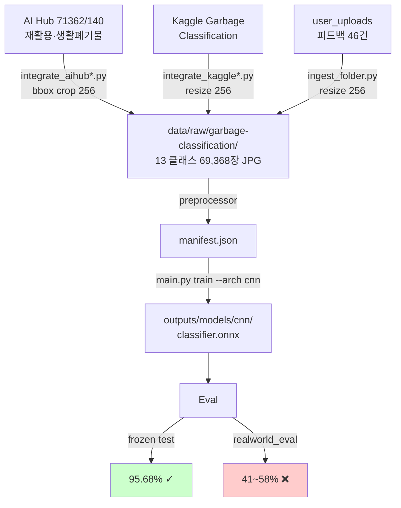
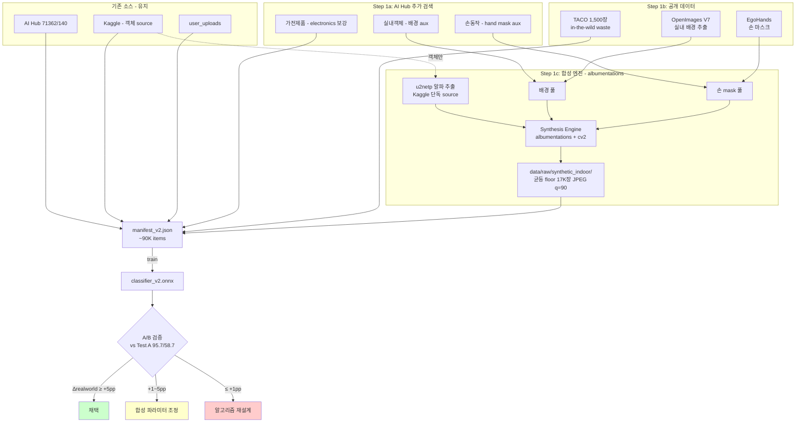
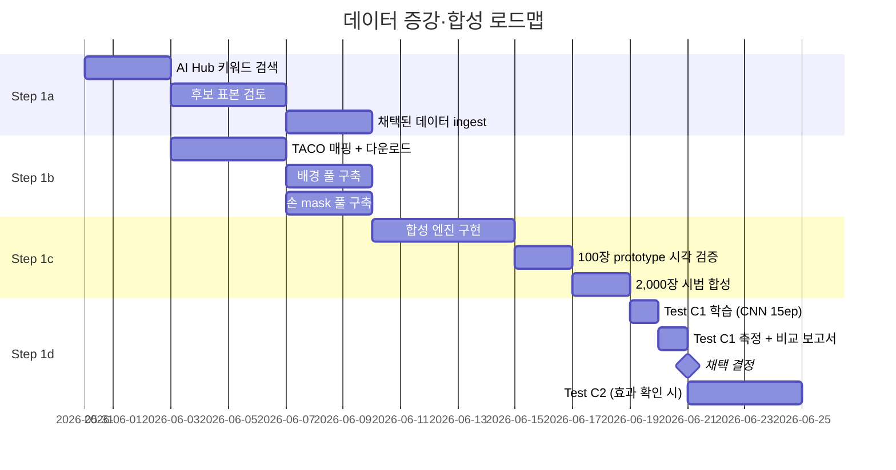

# 데이터 증강·합성 파이프라인 설계 (Phase 1)

> 작성: 2026-05-30 (v2 — 결정 사항 반영, 라이브러리 레벨 상세화)
> 목표: realworld 41~58% → **80%+** (사용자 분포에 가까운 학습 데이터 확보)
> 검증: 각 단계별 A/B 비교로 효과 정량화 — 효과 ≥ +5pp 일 때만 다음 단계 진행

---

## 1. 배경과 전제

### 1.1 검증된 사실
- **frozen test 95.7% vs realworld 41~58%** — 도메인 격차가 본질
- 학습 데이터 indoor_household 비율: **3%** (목표 분포의 거의 부재)
- 모델 capacity 한계는 도달 (val=test=96%, 더 학습해도 같은 분포에선 향상 없음)
- 가설 "AI Hub paper 노이즈가 over-fire 원인" 은 [Test A/B 비교](AIHUB_PAPER_HYPOTHESIS_TEST.md) 로 **기각** — 더 근본적인 분포 격차가 원인
- 의류/종이 over-fire 가 아니라 **클래스 가중치 amplification 으로 cardboard/non_object 가 OOD sink** 화 (별도 분석)
- **데이터 부족(분포 격차)이 80%+ 의 책임**

### 1.2 4 도메인 갭 축
| 갭 축 | 부족 | 해결 방법 |
|---|---|---|
| A. 실내 가정 배경 | 학습 3% | 공개 데이터 (OpenImages·MIT Indoor 67) 로 풀 구축 |
| B. 손/신체 동반 | 학습 ~0% | EgoHands·AI Hub 손 데이터 → mask 추출 |
| C. 폰 카메라 시점 | 거의 없음 | 합성 시 도메인 randomization 으로 일부 |
| D. 폐기물 × 가정 결합 | 거의 없음 | **합성 파이프라인으로 직접 만듦** |

### 1.3 WebP 도입 검증 결과 (요약)
- 사용자 가정 "WebP=무손실, 대폭 절감" 은 PNG → WebP 시나리오에만 성립
- 우리 데이터 (이미 JPG) 측정: lossless WebP 는 4.5배 더 큼, lossy q=85 는 13% 절감 (PSNR ~40dB, imperceptible)
- 신규 합성도 마찬가지 (~12% 절감)
- **결정: 모든 데이터 JPEG 유지. WebP 도입하지 않음** (절감 미미, 추가 손실, 변경 비용 큼)

---

## 2. AS-IS — 현재 데이터 파이프라인



---

## 3. TO-BE — 합성·증강 파이프라인 추가



---

## 4. Step 1a — AI Hub 추가 데이터 검색·확보

### 4.1 키워드 검색 우선순위
1순위 (사용자 분포 직접 보강):
- `재활용`, `폐기물`, `분리수거`, `재활용품` — 추가 미발견 데이터셋 탐색
- `가전제품`, `소형가전`, `생활가전` — electronics 클래스 보강

2순위 (aux 데이터 — 합성 풀):
- `손`, `손동작`, `손 제스처`, `핸드 인식`, `gesture` — hand mask 추출
- `생활공간`, `가정환경`, `실내 객체`, `리빙룸` — indoor background 추출

3순위 (특수 케이스):
- `식품 포장`, `포장재` — plastic/glass/cardboard 시각 다양성 보강
- `의류`, `직물` — clothes 다양성

### 4.2 후보 평가 절차
각 후보 데이터셋:
1. CLI 로 datasetKey 확인 + 메타정보 조회
2. **라이센스 검증** — "개방데이터" 인지 (상업 OK), DB 재배포 금지 확인
3. 100장 표본 다운로드 → 시각 검토 (이전 466장 분석 같은 방식)
4. **라벨 정합성 70%+ 게이트** — 통과 시에만 채택. AI Hub paper 처럼 40% 인 경우 폐기

### 4.3 산출물
- `scripts/aihub_search.py` (신규) — 키워드별 데이터셋 ID 자동 수집
- `scripts/integrate_aihub_appliances.py` (신규) — 가전제품 ingest
- `scripts/extract_hand_masks_aihub.py` (신규)
- `scripts/extract_indoor_bg_aihub.py` (신규)
- `diagnostics/aihub_candidate_evaluation.csv` — 후보별 표본 검토 결과

---

## 5. Step 1b — 공개 데이터 (TACO + 배경 + 손)

### 5.1 TACO 라벨 매핑 (60+ → 13)

TACO supercategory → 우리 클래스 매핑 초안 (시각 검토로 최종 결정):

| TACO supercategory | 매핑 → | 신뢰도 |
|---|---|---|
| Magazine paper, Tissues, Normal paper, Paper bag, Paper straw | **paper** | 높음 |
| Wrapping paper, Plastified paper bag | paper or vinyl | 시각 검토 |
| Toilet tube, Other carton, Egg carton, Drink carton, Corrugated carton, Meal carton, Pizza box, Paper cup | **cardboard** | 높음 |
| Glass bottle, Glass jar, Glass cup, Broken glass | **glass** | 높음 |
| Aluminium foil, Aerosol, Food Can, Drink can, Metal bottle cap, Metal lid, Scrap metal, Pop tab | **metal** | 높음 |
| Clear plastic bottle, Other plastic bottle, Plastic bottle cap, Disposable plastic cup, Other plastic cup, Plastic lid, Spread tub, Tupperware, Disposable food container, Other plastic container, Squeezable tube, Other plastic | **plastic** | 높음 |
| Plastic film, Six pack rings, Garbage bag, Other plastic wrapper, Single-use carrier bag, Polypropylene bag, Crisp packet, Plastic straw | **vinyl** | 높음 |
| Foam cup, Foam food container, Styrofoam piece | **styrofoam** | 높음 |
| Food waste | **food_waste** | 높음 |
| Battery | **electronics** | 부분 (배터리만) |
| Shoe | **clothes** | 약함 (신발은 별도지만 가까움) |
| Cigarette, Unlabeled litter, Plastic glooves, Plastic utensils, Rope & strings, Aluminium blister pack, Carded blister pack | **etc** | 합리적 |

매핑 결정 로그: `diagnostics/taco_mapping_decisions.csv` 에 (taco_supercategory, our_class, decision, note) 기록.

### 5.2 실내 배경 풀 구축
공급원:
- **Open Images V7** 의 indoor scene subset (직접 다운로드 가능)
- **MIT Indoor 67** (https://web.mit.edu/torralba/www/indoor.html) — 67 카테고리 실내 환경
- AI Hub 실내객체 (4.1 의 결과 활용)

품질 게이트:
- 해상도 ≥ 640x480
- 이미 폐기물이 화면에 두드러진 경우 제외 (간이 객체 검출로 자동 필터)
- 다양성 확보: 카테고리별 분포 (주방 30%, 거실 25%, 책상/사무실 20%, 베란다/창고 15%, 기타 10%)

목표: **5,000~10,000장 풀**

### 5.3 손 mask 풀
공급원:
- **EgoHands** (http://vision.soic.indiana.edu/projects/egohands/) — 4,800장 1인칭 손, segmentation mask 포함
- AI Hub 손 데이터 (4.1 결과)

처리: 각 손 이미지에서 alpha mask 추출 → PNG (RGBA) 저장. 평균 700~1500 px 손 크기

목표: **500~1,000개 mask** (다양성 충분)

### 5.4 산출물
- `scripts/integrate_taco.py` — TACO 다운로드 + 매핑 + ingest (preprocessor manifest 갱신)
- `scripts/build_indoor_bg_pool.py` — 배경 풀 구축
- `scripts/build_hand_mask_pool.py` — 손 mask 풀 구축

---

## 6. Step 1c — 합성 엔진 (albumentations 기반)

### 6.1 의존성
```
albumentations==1.4.18   # 학습 + 합성 augmentation 통일
opencv-python==4.10.0    # 기하 변환, 그림자 합성
Pillow==10.4.0          # 이미 있음
numpy==1.26.x           # 이미 있음
```

설치: `cd waste-classifier && .venv/bin/pip install albumentations opencv-python`

### 6.2 합성 엔진 구조 (`scripts/synthesize_indoor.py`)

```python
import numpy as np
import cv2
import albumentations as A
from PIL import Image
from pathlib import Path
import onnxruntime as ort

# 합성 후처리 (폰 카메라 도메인 randomization)
SYNTHESIS_AUGMENT = A.Compose([
    # 색온도/노출
    A.RandomBrightnessContrast(brightness_limit=0.15, contrast_limit=0.10, p=0.7),
    A.HueSaturationValue(hue_shift_limit=10, sat_shift_limit=15, val_shift_limit=10, p=0.5),
    A.RandomGamma(gamma_limit=(85, 115), p=0.3),
    # 폰 카메라 노이즈/압축
    A.ImageCompression(quality_lower=75, quality_upper=95, p=0.5),
    A.MotionBlur(blur_limit=5, p=0.15),
    A.GaussNoise(var_limit=(10, 30), p=0.2),
    A.ISONoise(intensity=(0.05, 0.20), p=0.2),
    # 광원 다양화
    A.RandomShadow(shadow_roi=(0, 0.5, 1, 1), p=0.3),
    A.RandomSunFlare(flare_roi=(0, 0, 1, 0.5), src_radius=80, p=0.1),
])


class SynthesisEngine:
    def __init__(self, u2netp_path, bg_pool_dir, hand_pool_dir):
        self.u2net = ort.InferenceSession(str(u2netp_path),
                                          providers=['CPUExecutionProvider'])
        self.bg_pool = sorted(Path(bg_pool_dir).glob('*.jpg'))
        self.hand_pool = sorted(Path(hand_pool_dir).glob('*.png'))

    def extract_object_alpha(self, obj_img):
        """u2netp 으로 객체 alpha mask 추출 (320x320)."""
        # ... (segment.py 의 _preprocess 와 동일 패턴)
        return alpha

    def compose(self, obj_pil, bg_pil, hand_pil=None, params=None):
        """객체 + 배경 + 손 → 합성 RGB 이미지."""
        rng = np.random.default_rng(params['seed'])

        # 1. 배경 크기 통일 (학습 입력 224 보다 약간 큼 → 224 random crop 가능)
        bg = np.asarray(bg_pil.resize((320, 320), Image.LANCZOS), dtype=np.float32)

        # 2. 객체 마스크 추출 + 크롭
        alpha = self.extract_object_alpha(obj_pil)  # (320, 320), 0~1
        obj_arr = np.asarray(obj_pil.resize((320, 320), Image.BILINEAR), dtype=np.float32)
        ys, xs = np.where(alpha > 0.5)
        if len(ys) < 100: return None  # 객체 너무 작음 — skip
        y0, y1, x0, x1 = ys.min(), ys.max()+1, xs.min(), xs.max()+1
        obj_crop = obj_arr[y0:y1, x0:x1]
        alpha_crop = alpha[y0:y1, x0:x1]

        # 3. 회전 + 스케일
        obj_rot = self._rotate(obj_crop, params['rotation'])
        alpha_rot = self._rotate(alpha_crop, params['rotation'])
        scale_px = int(320 * params['scale'])  # 40~70% of 320
        obj_resized = cv2.resize(obj_rot, (scale_px, scale_px), cv2.INTER_AREA)
        alpha_resized = cv2.resize(alpha_rot, (scale_px, scale_px), cv2.INTER_LINEAR)

        # 4. 광원 매칭 (객체 평균 톤을 배경 톤으로 살짝 끌어옴)
        bg_mean = bg.mean(axis=(0,1))
        a3 = alpha_resized[..., None]
        obj_mean = (obj_resized * a3).sum(axis=(0,1)) / (a3.sum() + 1e-6)
        tint = (bg_mean - obj_mean) * 0.15
        obj_tinted = (obj_resized + tint).clip(0, 255)

        # 5. 그림자 (gaussian-blurred alpha → 배경에 부분 darkening)
        shadow = cv2.GaussianBlur(alpha_resized, (15, 15), sigmaX=8) * 0.35

        # 6. 객체 placement
        cx, cy = params['pos']
        px = int(cx * (320 - scale_px))
        py = int(cy * (320 - scale_px))

        result = bg.copy()
        # 그림자 적용 (offset 5,5 — 오른쪽 아래)
        sy, sx = py + 5, px + 5
        ye, xe = min(sy+scale_px, 320), min(sx+scale_px, 320)
        if ye > sy and xe > sx:
            sh = shadow[:ye-sy, :xe-sx]
            result[sy:ye, sx:xe] *= (1 - sh[..., None])
        # 객체 alpha blend
        ye2, xe2 = min(py+scale_px, 320), min(px+scale_px, 320)
        if ye2 > py and xe2 > px:
            obj_region = obj_tinted[:ye2-py, :xe2-px]
            a_region = alpha_resized[:ye2-py, :xe2-px, None]
            result[py:ye2, px:xe2] = obj_region * a_region + result[py:ye2, px:xe2] * (1 - a_region)

        # 7. 손 mask overlay (선택 — 50% 확률로 추가)
        if hand_pil is not None and rng.random() < 0.5:
            result = self._overlay_hand(result, hand_pil, obj_bbox=(px, py, px+scale_px, py+scale_px))

        # 8. 후처리 augmentation (폰 카메라 도메인 시뮬)
        augmented = SYNTHESIS_AUGMENT(image=result.astype(np.uint8))['image']

        return Image.fromarray(augmented)

    def _rotate(self, arr, angle):
        h, w = arr.shape[:2]
        M = cv2.getRotationMatrix2D((w/2, h/2), angle, 1.0)
        return cv2.warpAffine(arr, M, (w, h), borderValue=0)

    def _overlay_hand(self, base, hand_pil, obj_bbox):
        # 손을 객체 좌하/우하 모서리에 위치 + 부분만 보이게
        # 단순화: 추후 정교화
        ...
```

### 6.3 합성 파라미터 sampling
객체 × 배경 × 손 조합 추출 (균등 floor 정책):
```python
def sample_params(rng, target_class):
    return {
        'scale': rng.uniform(0.4, 0.7),
        'rotation': rng.uniform(-15, 15),
        'pos': (rng.uniform(0.15, 0.45), rng.uniform(0.15, 0.45)),  # 중앙 편향
        'seed': int(rng.integers(0, 2**31)),
    }

def synthesize_class(engine, target_class, n_samples, obj_pool, bg_pool, hand_pool, out_dir):
    """클래스별 n_samples 장 합성."""
    rng = np.random.default_rng(seed=42 + hash(target_class) % 10000)
    for i in range(n_samples):
        obj_pil = Image.open(rng.choice(obj_pool))    # Kaggle 객체만
        bg_pil = Image.open(rng.choice(bg_pool))      # 실내 배경
        hand_pil = Image.open(rng.choice(hand_pool)) if rng.random() < 0.5 else None
        params = sample_params(rng, target_class)

        composed = engine.compose(obj_pil, bg_pil, hand_pil, params)
        if composed is None: continue

        out_path = out_dir / target_class / f'synth_{target_class}_{i:06d}.jpg'
        composed.save(out_path, 'JPEG', quality=90)
        log_synthesis(out_path, obj_pil, bg_pil, hand_pil, params)  # manifest jsonl
```

### 6.4 합성 품질 게이트
모든 합성이 학습용 OK 아님. 자동 거절:
- 객체 alpha 면적 < 10% → too small
- 객체가 프레임 경계 침범 (15% 이상 잘림) → reject
- 합성 후 CAM proxy 점수 (entropy) 임계값 아래 → reject (객체가 묻혀버린 경우)

### 6.5 산출물
- `scripts/synthesize_indoor.py` — 메인 엔진
- `scripts/synth_quality_check.py` — 자동 거절 + spot check 리포트
- `data/raw/synthetic_indoor/` — 출력 디렉토리

---

## 7. Step 1d — 통합 학습 + A/B 검증

### 7.1 클래스별 합성 quota (균등 floor 채택)

목표: 모든 클래스가 indoor 분포 데이터 **최소 3,000장** 확보.

| 클래스 | 현재 | 합성 목표 | 합성 후 indoor 비율 |
|---:|---:|---:|---:|
| etc | 12 | **+2,988** | 100% |
| non_object | 720 | +2,280 | 76% |
| cardboard | 1,296 | +1,704 | 57% |
| food_waste | 986 | +2,014 | 67% |
| electronics | 1,000 | +2,000 | 67% |
| trash | 834 | +2,166 | 72% |
| clothes | 7,305 | +500 (소량) | 6% |
| paper | 9,363 | +500 | 5% |
| plastic | 10,002 | +500 | 5% |
| glass | 10,000 | +500 | 5% |
| metal | 10,000 | +500 | 5% |
| vinyl | 10,002 | +500 | 5% |
| styrofoam | 10,000 | +500 | 5% |
| **합계** | **69,368** | **~17,000** | — |

### 7.2 시범 2,000장 분배 (Step 1c 첫 산출물)

6 약점 클래스 집중:
| 클래스 | 합성 장수 | 비고 |
|---:|---:|---|
| etc | 400 | 가장 부족 (12장) |
| non_object | 350 | 학습 데이터 720장도 facility 분포 |
| cardboard | 350 | Kaggle 단독, 도메인 갭 큼 |
| electronics | 300 | AI Hub close-up 위주 |
| food_waste | 300 | Kaggle 단독 |
| trash | 300 | Kaggle 단독 |
| **합계** | **2,000** | 효과 측정용 prototype |

대용량 클래스는 시범 단계 제외 → 효과 더 명확히 측정.

### 7.3 A/B 실험 계획
| Test | 데이터 구성 | 측정 |
|---|---|---|
| **Test A (현재 baseline)** | 69,368 그대로 | frozen 95.68%, realworld 41.3%/58.7% (측정 완료) |
| **Test C1 (prototype)** | + 2,000 합성 (6 약점) | frozen + realworld |
| **Test C2 (full floor)** | + 17,000 합성 (모든 클래스 균등 floor) | frozen + realworld |
| **Test C3 (확장)** | + 50,000 합성 | 한계 효과 측정 |

### 7.4 채택 기준
| Δ realworld vs Test A | 의미 | 결정 |
|---|---|---|
| ≥ +5pp | 합성 효과 확실 | 채택 + 다음 단계 |
| +2~5pp | 부분 효과 | 합성 파라미터 조정 후 재시도 |
| -2 ~ +2pp | 미미/노이즈 수준 | 합성 알고리즘 재설계 |
| < -2pp | artifact 학습 (역효과) | 합성 비율 낮추고 품질 게이트 강화 |

### 7.5 측정 자동화
[realworld_eval.py](../waste-classifier/realworld_eval.py) + diagnose 자동 실행 — Test B 의 continuation 패턴 차용:
- 학습 종료 시 자동 export ONNX
- 자동 realworld + frozen 측정
- 결과를 `diagnostics/test_{name}_results.json` 에 저장
- MD 비교표 자동 갱신

---

## 8. 실행 순서 (단계별 의존)



각 단계는 이전 단계 일부 완료 시 시작 가능 (parallel). 총 **약 4~6주** 예상.

---

## 9. 리스크와 완화

| 리스크 | 영향 | 완화 |
|---|---|---|
| 합성 artifact 가 OOD 신호로 학습 | 효과 미달 또는 부정적 | 품질 게이트 + 도메인 randomization, real 비율 ≥ 80% 유지 |
| AI Hub 추가 데이터도 facility 분포 | 분포 격차 그대로 | 표본 검토 게이트 (라벨 정합성 70%) 로 사전 차단 |
| TACO 라벨 매핑 오류 | 학습 노이즈 | 매핑 결정을 csv 로 로그, 시각 spot check, conservative 매핑 (불확실한 건 etc) |
| u2netp 가 객체 부분만 잡음 | 합성 이미지에 객체 일부 잘림 | alpha 면적 게이트 (50% 이상), 잘림 시 reject |
| 합성 vs real 비율 잘못 잡힘 | 효과 없음 | C1~C3 다른 비율로 측정해 최적점 탐색 |
| albumentations 버전 충돌 | 학습 환경 오류 | requirements pin, 가상환경 격리 |
| realworld eval 46건 통계적 noise | 효과 판정 오류 | 같은 모델 3 seed 학습 후 변동성 측정, eval 표본 늘리기 |

---

## 10. 결정 사항 (확정)

| # | 항목 | 결정 |
|---|---|---|
| D1 | 클래스별 quota | **균등 floor** (모든 클래스 ≥ 3,000 indoor) |
| D2 | TACO 우선 | TACO 빠른 실험용 먼저 통합 |
| D3 | 보강 범위 | **전 클래스** (소수 클래스 집중 후 대용량도 소량 추가) |
| D4 | 합성 라이브러리 | **albumentations==1.4.18** + opencv-python |
| D5 | 시범 규모 | **2,000장** prototype (6 약점 클래스 분배) |
| D6 | 합성 객체 source | **Kaggle 단독** (라벨 정합성 95%+) |
| D7 | realworld eval 자동화 | Test C1/2/3 마다 continuation 스크립트로 자동 |
| D8 | WebP 도입 | **포기** (절감 미미, 추가 손실, 변경 비용) |
| D9 | 합성 저장 포맷 | JPEG q=90 |
| D10 | 합성 데이터 저장 방식 | Pre-generated to disk (on-the-fly 아님) |

---

## 11. 합성 데이터 정책 (확정)

### 11.1 디렉토리 구조
```
data/raw/synthetic_indoor/
  cardboard/
    synth_cardboard_000000.jpg
    synth_cardboard_000001.jpg
    ...
  electronics/, etc/, food_waste/, glass/, metal/, ...

  _aux/
    objects/           # u2netp 으로 추출한 객체 alpha (재사용)
      kaggle_cardboard_cardboard1_alpha.png
      ...
    backgrounds/       # 실내 배경 풀 (재사용)
      openimg_kitchen_00001.jpg
      ...
    hand_masks/        # 손 mask 풀 (재사용)
      egohands_005_3.png
      ...

  _manifest.jsonl      # 합성별 메타 (재현용)
  _synthesis_config.json  # 알고리즘 버전·파라미터 default
```

### 11.2 메타데이터 (재현성)
`_manifest.jsonl` 각 줄:
```json
{
  "synth_id": "synth_etc_000142",
  "class": "etc",
  "object_source": "kg2_glass_glass234.jpg",
  "background_source": "openimg_kitchen_00891.jpg",
  "hand_mask": "egohands_005_3.png",
  "params": {"scale": 0.52, "pos": [0.48, 0.51], "rotation": 8, "seed": 4882},
  "synthesis_version": "v1",
  "generated_at": "2026-05-30T20:14:33Z"
}
```

→ 같은 seed + 같은 source files → 비트 단위로 같은 결과. 학습 후 "특정 합성 이미지의 효과" 분석 가능.

### 11.3 재생성 정책
| 변경 사항 | 조치 |
|---|---|
| 합성 알고리즘 변경 (compose 함수) | 전체 재생성, `v1` → `v2` 디렉토리 |
| 객체 풀 변경 (Kaggle 외 추가) | 영향받은 클래스만 재생성 |
| 배경/손 풀 변경 | 새 합성만 추가 (기존 보존) |
| albumentations 파라미터 조정 | 새 합성만 추가 |

### 11.4 디스크 영향 (예상)
- 시범 2,000장 × 평균 12KB ≈ **24MB**
- 균등 floor 17,000장 × 12KB ≈ **200MB**
- aux 데이터 (객체 alpha 5K + 배경 5K + 손 1K) ≈ **500MB~1GB**
- 총 신규 디스크 사용량 약 **1.2~1.5GB**
- 현재 raw 700MB 의 ~2배. 받아들일 수 있는 수준

### 11.5 학습 통합
- preprocessor 가 `data/raw/synthetic_indoor/{class}/` 도 manifest 에 포함
- source_path prefix 로 구분: `data/raw/synthetic_indoor/...`
- frozen test 는 synthetic 제외 (real 분포로만 측정)
- splits: synthetic 은 train/val 만, test 진입 차단

### 11.6 학습 시 augmentation (별도)
albumentations train-time pipeline (학습 dataloader 에서 적용):
```python
TRAIN_AUGMENT = A.Compose([
    A.HorizontalFlip(p=0.5),
    A.Rotate(limit=10, p=0.5),
    A.RandomBrightnessContrast(brightness_limit=0.1, contrast_limit=0.1, p=0.3),
    A.Normalize(mean=[0.485, 0.456, 0.406], std=[0.229, 0.224, 0.225]),
    ToTensorV2(),
])
```
→ 합성에 적용한 augmentation 과 별개. 학습 시 추가 다양성.

---

## 12. 다음 즉시 작업 (Step 1a 진입)

1. ✅ 설계 승인 완료
2. 🟡 **AI Hub 키워드 검색** (지금 시작)
3. ⏳ 검색 결과 → 후보 표본 검토 → 채택 결정
4. ⏳ Step 1b/c/d 순차 진행

---

*문서 위치: [/Users/whdrnr01/ai/waste-preprocessor/DATA_AUGMENTATION_DESIGN.md](DATA_AUGMENTATION_DESIGN.md)*
*관련 문서: [AIHUB_PAPER_HYPOTHESIS_TEST.md](AIHUB_PAPER_HYPOTHESIS_TEST.md), [SMART_CAPTURE_STRATEGY.md](../SMART_CAPTURE_STRATEGY.md), [GREENGUIDE_BLUEPRINT.md](../GREENGUIDE_BLUEPRINT.md)*
